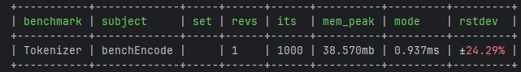

# Performance-first Tokenizer implementation in PHP

```
composer require neuron-core/tokeinzer
```

## BPE (Byte-Pair Encoding) Tokenizer

This implementation requires an already trained vocabulary and merges files. It's focused on performance
with cache strategy and priority queue.

```php
$tokenizer = new BPETokenizer();

// Initialize pre-trained tokenizer
$tokenizer->loadFrom(
    __DIR__.'/../dataset/bpe-vocabulary.json',
    __DIR__.'/../dataset/bpe-merges.txt'
);

// Tokenize text
$tokens = $tokenizer->encode('Hello world!');

var_dump($tokens);
```

## Benchmarks

The benchmarks are done with [PHPBench](https://github.com/phpbench/phpbench), and they show a sub millisecond performance
encoding the text below:

```
Contrary to popular belief, Lorem Ipsum is not simply random text. It has roots in a piece of classical Latin literature from 45 BC, making it over 2000 years old. Richard McClintock, a Latin professor at Hampden-Sydney College in Virginia, looked up one of the more obscure Latin words, consectetur, from a Lorem Ipsum passage, and going through the cites of the word in classical literature, discovered the undoubtable source. Lorem Ipsum comes from sections 1.10.32 and 1.10.33 of "de Finibus Bonorum et Malorum" (The Extremes of Good and Evil) by Cicero, written in 45 BC. This book is a treatise on the theory of ethics, very popular during the Renaissance. The first line of Lorem Ipsum, "Lorem ipsum dolor sit amet..", comes from a line in section 1.10.32.

The standard chunk of Lorem Ipsum used since the 1500s is reproduced below for those interested. Sections 1.10.32 and 1.10.33 from "de Finibus Bonorum et Malorum" by Cicero are also reproduced in their exact original form, accompanied by English versions from the 1914 translation by H. Rackham.
```

With the already trained GPT-2 datasets:

- Vocabulary: https://huggingface.co/gpt2/resolve/main/vocab.json
- Merges: https://huggingface.co/gpt2/resolve/main/merges.txt


